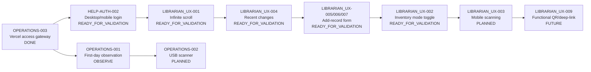

# Roadmap

Статусы:

- **DONE** — завершено и принято.
- **READY_FOR_VALIDATION** — реализовано, требуется локальный/staging/production acceptance-test.
- **NEXT** — следующий приоритет.
- **PLANNED** — запланировано.
- **OBSERVE** — эксплуатационное наблюдение.
- **FUTURE** — идея сохранена, но реализация не требуется без подтверждённого сценария.



| ID | Статус | Содержание |
| --- | --- | --- |
| OPERATIONS-003 | DONE | Пользовательский доступ через `https://mlc-vercel-access.vercel.app/`; Cloudflare Worker остаётся backend. |
| HELP-AUTH-002 | READY_FOR_VALIDATION | Инструкция без привязки к браузеру; отдельный вход с компьютера и телефона; корректное завершение работы. |
| LIBRARIAN_UX-001 | READY_FOR_VALIDATION | Собственная прокрутка таблицы; подгрузка по 200 записей при приближении к низу. |
| LIBRARIAN_UX-002 | READY_FOR_VALIDATION | Явно включаемый/выключаемый режим инвентаризации; безопасное выключенное состояние по умолчанию. |
| LIBRARIAN_UX-003 | PLANNED | Камера телефона для штрихкода/QR. |
| LIBRARIAN_UX-004 | READY_FOR_VALIDATION | Сортировка по автору/заглавию или по `updated_at DESC`; колонка «Изменено». |
| LIBRARIAN_UX-005 | READY_FOR_VALIDATION | Добавление экземпляра сразу через полный формуляр; инвентарный номер основной, `db_number` необязателен и при создании остаётся пустым. |
| LIBRARIAN_UX-006 | READY_FOR_VALIDATION | Заглавие и другие многострочные поля автоматически растут по содержимому. |
| LIBRARIAN_UX-007 | READY_FOR_VALIDATION | Основа новой карточки ищется на сервере по автору или инвентарному номеру. |
| LIBRARIAN_UX-008 | READY_FOR_VALIDATION | Старый QR-блок с библиографическими данными удалён из карточки. |
| LIBRARIAN_UX-009 | FUTURE | Возвращать QR только как функциональный deep-link/инвентаризационный сценарий, если он действительно нужен. |
| OPERATIONS-001 | OBSERVE | Проверка pending/conflict и резервная копия после первого рабочего дня. |
| OPERATIONS-002 | PLANNED | Acceptance-test USB-сканера. |
| PLATFORM-001 | PLANNED | PWA/offline hardening. |
| PLATFORM-002 | PLANNED | Cross-platform hardening. |

## Правило пользовательского доступа

Основной пользовательский адрес:

```text
https://mlc-vercel-access.vercel.app/
```

`workers.dev` остаётся техническим backend-адресом и не должен использоваться в ярлыках и пользовательских инструкциях.

Cloudflare и Vercel могут работать параллельно с одной production D1. Перед переходом между адресами или устройствами необходимо дождаться состояния **«Синхронизировано»**.
