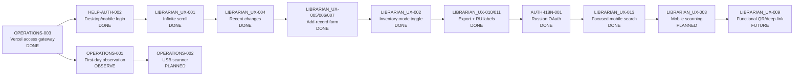

# Roadmap

Статусы:

- **DONE** — завершено и принято.
- **READY_FOR_VALIDATION** — реализовано, требуется локальный/staging/production acceptance-test.
- **NEXT** — следующий приоритет.
- **PLANNED** — запланировано.
- **OBSERVE** — эксплуатационное наблюдение.
- **FUTURE** — идея сохранена, но реализация не требуется без подтверждённого сценария.



| ID | Статус | Содержание |
| --- | --- | --- |
| OPERATIONS-003 | DONE | Пользовательский доступ через `https://mlc-vercel-access.vercel.app/`; Cloudflare Worker остаётся backend. |
| HELP-AUTH-002 | DONE | Инструкция без привязки к браузеру; отдельный вход с компьютера и телефона; корректное завершение работы. |
| LIBRARIAN_UX-001 | DONE | Собственная прокрутка таблицы; подгрузка по 200 записей при приближении к низу; заголовок таблицы фиксирован внутри области прокрутки. |
| LIBRARIAN_UX-002 | DONE | Явно включаемый/выключаемый режим инвентаризации; безопасное выключенное состояние по умолчанию. |
| LIBRARIAN_UX-003 | PLANNED | Камера телефона для штрихкода/QR. |
| LIBRARIAN_UX-004 | DONE | Сортировка по автору/заглавию или по времени изменения; стрелка переключает прямое/обратное направление. |
| LIBRARIAN_UX-005 | DONE | Добавление экземпляра сразу через полный формуляр; инвентарный номер основной, `db_number` необязателен и при создании остаётся пустым. |
| LIBRARIAN_UX-006 | DONE | Библиографические текстовые поля карточки и формы добавления автоматически растут по содержимому. |
| LIBRARIAN_UX-007 | DONE | Поле основы пустое по умолчанию; ввод автора или инвентарного номера автоматически открывает список релевантных карточек. |
| LIBRARIAN_UX-008 | DONE | Старый QR-блок с библиографическими данными удалён из карточки. |
| LIBRARIAN_UX-009 | FUTURE | Возвращать QR только как функциональный deep-link/инвентаризационный сценарий, если он действительно нужен. |
| LIBRARIAN_UX-010 | DONE | CSV-экспорт скрыт за подсвеченным двухшаговым контролом «Экспорт каталога». |
| LIBRARIAN_UX-012 | DONE | Компактный статус синхронизации; ручная отправка показывается только при наличии ожидающих операций. |
| LIBRARIAN_UX-011 | DONE | Категории поиска и сортировки отображаются по-русски, внутренние API-значения пользователю не показываются. |
| LIBRARIAN_UX-013 | DONE | На телефоне/планшете фокус по поиску открывает отдельный viewport-aware режим: результаты прокручиваются над строкой поиска, строка следует за видимой областью над экранной клавиатурой; desktop UX не изменяется. |
| LIBRARIAN_UX-014 | PLANNED | Убрать «№ записи в БД» из пользовательского списка категорий поиска, сохранив `dbNumber` в API и поиске «Все поля»; низкий приоритет. |
| AUTH-I18N-001 | DONE | OAuth authorization через `oauth.yandex.ru`; Vercel relay поддерживает русский hostname и сохраняет callback. |
| AUTH-SESSION-002 | PLANNED | Завершение сессии после 2 часов отсутствия активности при сохранении абсолютного максимального срока сессии. |
| OPERATIONS-001 | OBSERVE | Проверка pending/conflict и резервная копия после первого рабочего дня. |
| OPERATIONS-002 | PLANNED | Acceptance-test USB-сканера. |
| PLATFORM-001 | PLANNED | PWA/offline hardening. |
| PLATFORM-002 | PLANNED | Cross-platform hardening. |

## Правило пользовательского доступа

Основной пользовательский адрес:

```text
https://mlc-vercel-access.vercel.app/
```

`workers.dev` остаётся техническим backend-адресом и не должен использоваться в ярлыках и пользовательских инструкциях.

Cloudflare и Vercel могут работать параллельно с одной production D1. Перед переходом между адресами или устройствами необходимо дождаться состояния **«Синхронизировано»**.
